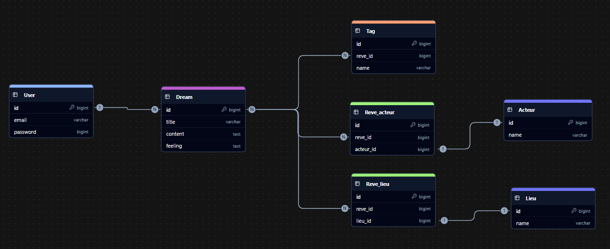
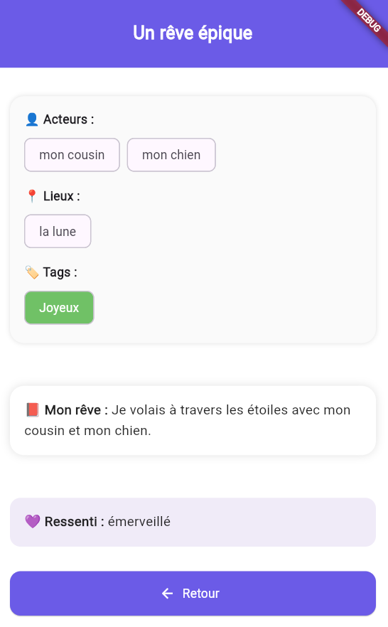

# Revato

**Revato** est une application multiplateforme de prise de notes des rêves réalisés.
Son objectif : vous permettre de noter rapidement vos rêves pour les archiver et les relire ultérieurement.
À terme, des graphiques viendront analyser les éléments récurrents et leurs corrélations pour visualiser vos influences oniriques.

---

## 📂 Structure du projet

```text
Revato-flutter/
├── .github/            # workflows CI/CD
├── api/                # backend Symfony
├── app/                # application Flutter
├── caddy/              # configuration du serveur web Caddy
├── php/                # Dockerfile PHP/Symfony
├── .gitignore
├── compose.yaml        # services Docker Compose
└── README.md
```

---

## 🚀 Installation et exécution

### 1. Prérequis

* Docker & Docker Compose

### 2. Clonage du dépôt

```bash
git clone https://github.com/Xantos07/Revato-Flutter.git
cd Revato-Flutter
```

### 3. Construction des services

```bash
docker-compose build
```

### 4. Lancement en arrière-plan

```bash
docker-compose up -d
```
---

### 5. Ouvrir un shell dans le container Flutter

```bash
docker-compose exec flutter bash
```

---

### 6. Activer le support Web et précharger le SDK

```bash
flutter config --enable-web    # active la plateforme web
flutter precache --web         
```

---

### 7. Vérifier l’état de Flutter et les devices

```bash
flutter doctor -v
flutter devices
```

---

### 8. Installer les dépendances Dart/Flutter

```bash
flutter pub get
```

---

### 9. Lancer l’application en mode Web

```bash
flutter run -d web-server --web-hostname=localhost --web-port=9000
```

### Ouvrez ensuite dans votre navigateur hôte :

```
http://localhost:9000
```

---

## 🗄️ Schémas

* **Base de données**
  

---

## 🛠️ Technologies & choix

| Technologie          | Motivation                                                                                                 |
| -------------------- | ---------------------------------------------------------------------------------------------------------- |
| **Docker / Compose** | Isolation des services, portabilité et déploiement rapide et reproductible.                                |
| **MariaDB**          | SGBDR open source, performant et fiable pour stocker des données structurées.                              |
| **Flutter**          | Développement mobile & web multiplateforme avec une base de code unique, offrant une UI fluide et moderne. |
| **Symfony**          | Framework PHP modulaire, sécurisé et maintenable, idéal pour structurer une API REST.                      |
| **Git**              | Gestion de versions distribuée, facilitant le travail en équipe et l’intégration continue.                 |

---

## ⚙️ Commandes utiles

### Accès au conteneur Symfony

```bash
docker exec -it php82_revato bash
```

### Lancer l’application dans un navigateur

```bash
flutter run -d chrome --web-hostname=localhost --web-port=9000
```

### Liste des appareils disponibles

```bash
flutter devices
```

### Lancer sur un appareil spécifique

```bash
flutter run -d <device_id>
```

### Génération d’un APK Android (release)

```bash
flutter build apk --release
```

### Génération d’une build iOS (release)

```bash
flutter build ios --release
```

---


## 📱 L'application actuelle

<p align="center">
  
  
</p>
<p align="center">
  
  
</p>
